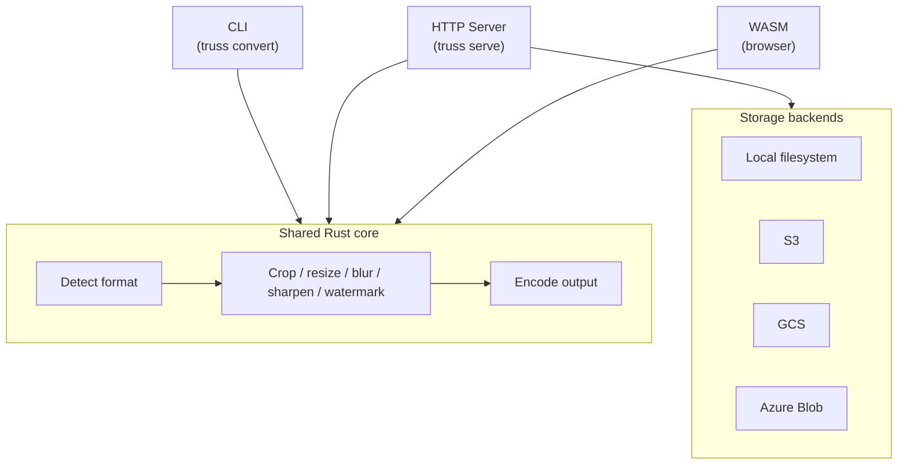

# truss

[](https://github.com/nao1215/truss/actions/workflows/rust.yml)
[](https://github.com/nao1215/truss/actions/workflows/integration-cli.yml)
[](https://github.com/nao1215/truss/actions/workflows/integration.yml)
[](https://crates.io/crates/truss-image)
[](https://crates.io/crates/truss-image)
[](LICENSE)
[](https://www.rust-lang.org/)


Resize, crop, convert, blur, sharpen, and watermark images from the CLI, an HTTP server, or the browser -- written in Rust with signed-URL authentication and SSRF protection built in.

[Try the WASM demo in your browser](https://nao1215.github.io/truss/) -- no install, no upload, runs 100 % client-side.


## Why truss?

- One binary, three interfaces -- the same Rust core powers the CLI, an HTTP image-transform server, and a WASM browser demo.
- Security by default -- signed URLs, SSRF protections, and SVG sanitization are built in.
- Broad format support -- JPEG, PNG, WebP, AVIF, BMP, and SVG; retains EXIF, ICC, and XMP metadata where possible.
- Cross-platform -- Linux, macOS, Windows.
- Tested contracts -- CLI behavior is locked by [ShellSpec](https://github.com/shellspec/shellspec), HTTP API by [runn](https://github.com/k1LoW/runn).

## Comparison

Feature comparison with [imgproxy](https://github.com/imgproxy/imgproxy) and [imagor](https://github.com/cshum/imagor) as of March 2026.

| Feature | truss | imgproxy | imagor |
|---------|:-----:|:--------:|:------:|
| Language | Rust | Go | Go |
| Runtime dependencies | None | libvips (C) | libvips (C) |
| CLI | Yes | No | No |
| WASM browser demo | Yes | No | No |
| Signed URLs | Yes | Yes | Yes |
| JPEG / PNG / WebP / AVIF | Yes | Yes | Yes |
| JPEG XL (JXL) | No | Input only | Yes |
| TIFF | Yes | Yes | Yes |
| GIF animation processing | No (out of scope) | Yes | Yes |
| SVG sanitization | Yes | Yes | No |
| Smart crop | No | Yes | Yes |
| Sharpen filter | Yes | Yes | Yes |
| Crop / Trim / Padding | Yes | Yes | Yes |
| S3  | Yes | Yes | Yes |
| GCS | Yes | Yes | Yes |
| Azure Blob Storage | Yes | Yes | No |
| Watermark | Yes | Yes | Yes |
| Prometheus metrics | Yes | Yes | Yes |
| License | MIT | Apache 2.0 | Apache 2.0 |

## Architecture



CLI reads local files or fetches remote URLs directly. The HTTP server resolves images from storage backends or client uploads. The WASM build processes files selected in the browser.

## Installation

```sh
cargo install truss-image
```

Prebuilt binaries are available on the [GitHub Releases](https://github.com/nao1215/truss/releases) page. See [Deployment Guide](docs/deployment.md) for details on all targets and Docker images.

## Quick Start

### CLI

The `convert` subcommand can be omitted: `truss photo.png -o photo.jpg` is equivalent to `truss convert photo.png -o photo.jpg`. Run `truss --help` to see the full set of options.

```sh
# Convert format
truss photo.png -o photo.jpg

# Resize + convert
truss photo.png -o thumb.webp --width 800 --format webp --quality 75

# Convert from a remote URL
truss --url https://example.com/img.png -o out.avif --format avif

# Sanitize SVG (remove scripts and external references)
truss diagram.svg -o safe.svg

# Inspect metadata
truss inspect photo.jpg
```

#### Examples: Blur & Watermark

| | Original | Gaussian Blur (`--blur 5.0`) | Watermark (`--watermark`) |
|---|---|---|---|
| |  |  |  |

```sh
# Blur
truss photo.jpg -o blurred.jpg --blur 5.0

# Sharpen
truss photo.jpg -o sharpened.jpg --sharpen 2.0

# Watermark
truss photo.jpg -o watermarked.jpg \
  --watermark logo.png --watermark-position bottom-right \
  --watermark-opacity 50 --watermark-margin 10
```

#### Examples: Crop, Rotate & Fit

| | Original | Crop (`--crop 100,50,400,300`) | Rotate (`--rotate 270`) | Fit cover (`--fit cover`) |
|---|---|---|---|---|
| |  |  |  |  |

```sh
# Crop a region (x, y, width, height) -- applied before resize
truss photo.jpg -o cropped.jpg --crop 100,50,400,300

# Rotate 270 degrees clockwise
truss photo.jpg -o rotated.jpg --rotate 270

# Fit into a 300x300 box using cover mode (fills the box, crops excess)
truss photo.jpg -o cover.jpg --width 300 --height 300 --fit cover
```

### HTTP Server -- one curl to transform

```sh
# Start the server
TRUSS_BEARER_TOKEN=changeme truss serve --bind 0.0.0.0:8080 --storage-root ./images

# Resize a local image to 400 px wide WebP in one request
curl -X POST http://localhost:8080/images \
  -H "Authorization: Bearer changeme" \
  -F "file=@photo.jpg" \
  -F 'options={"format":"webp","width":400}' \
  -o thumb.webp
```

See the [API Reference](docs/api-reference.md) for the full endpoint list and CDN integration guide.

## Commands

| Command | Description |
|---------|-------------|
| `convert` | Convert and transform an image file (can be omitted; see above) |
| `inspect` | Show metadata (format, dimensions, alpha) of an image |
| `serve` | Start the HTTP image-transform server (implied when server flags are used at the top level) |
| `validate` | Validate server configuration without starting the server (useful in CI/CD) |
| `sign` | Generate a signed public URL for the server |
| `completions` | Generate shell completion scripts |
| `version` | Print version information |
| `help` | Show help for a command (e.g. `truss help convert`) |

## Documentation

| Page | Description |
|------|-------------|
| [Configuration Reference](docs/configuration.md) | Environment variables, storage backends, logging, and all server settings |
| [API Reference](docs/api-reference.md) | HTTP endpoints, request/response formats, CDN integration |
| [Deployment Guide](docs/deployment.md) | Docker, prebuilt binaries, cloud storage (S3/GCS/Azure), production setup |
| [Development Guide](docs/development.md) | Building from source, testing, benchmarks, WASM demo, contributing |
| [Prometheus Metrics](doc/prometheus.md) | Metrics reference, bucket boundaries, example PromQL queries |
| [OpenAPI Spec](doc/openapi.yaml) | Machine-readable API specification |

## Roadmap

See the [public roadmap](https://github.com/nao1215/truss/issues?q=is%3Aissue+label%3Aroadmap) for planned features and milestones.

## Contributing

Contributions are welcome. See [CONTRIBUTING.md](CONTRIBUTING.md) for details.

- Look for [`good first issue`](https://github.com/nao1215/truss/issues?q=is%3Aissue+is%3Aopen+label%3A%22good+first+issue%22) to get started.
- Report bugs and request features via [Issues](https://github.com/nao1215/truss/issues).
- If the project is useful, starring the repository helps.
- Support via [GitHub Sponsors](https://github.com/sponsors/nao1215) is also welcome.
- Sharing the project on social media or in blog posts is appreciated.

## License

Released under the [MIT License](LICENSE).
