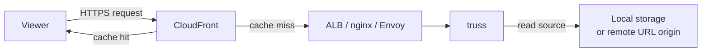

# truss

[](https://github.com/nao1215/truss/actions/workflows/rust.yml)
[](https://github.com/nao1215/truss/actions/workflows/integration-cli.yml)
[](https://github.com/nao1215/truss/actions/workflows/integration-api.yml)
[](https://crates.io/crates/truss-image)
[](https://crates.io/crates/truss-image)
[](LICENSE)
[](https://www.rust-lang.org/)


Resize, convert, blur, and watermark images from the CLI, an HTTP server, or the browser -- written in Rust with signed-URL authentication and SSRF protection built in.

[Try the WASM demo in your browser](https://nao1215.github.io/truss/) -- no install, no upload, runs 100 % client-side.


## Why truss?

- **One binary, three interfaces** -- the same Rust core powers the CLI, an HTTP image-transform server, and a WASM browser demo.
- **Security by default** -- signed URLs, SSRF protections, and SVG sanitization are built in.
- **Broad format support** -- JPEG, PNG, WebP, AVIF, BMP, and SVG; retains EXIF, ICC, and XMP metadata where possible.
- **Cross-platform** -- Linux, macOS, Windows.
- **Tested contracts** -- CLI behavior is locked by [ShellSpec](https://github.com/shellspec/shellspec), HTTP API by [runn](https://github.com/k1LoW/runn).

## Installation

```sh
cargo install truss-image
```

To enable S3 storage backend support, add `--features s3`:

```sh
cargo install truss-image --features s3
```

This installs the `truss` command.

## Quick Start

### CLI

Run `truss --help` to see the full set of options.

```sh
# Convert format
truss photo.png -o photo.jpg

# Resize + convert
truss photo.png -o thumb.webp --width 800 --format webp --quality 75

# Convert from a remote URL
truss --url https://example.com/img.png -o out.avif --format avif

# Sanitize SVG (remove scripts and external references)
truss diagram.svg -o safe.svg

# Rasterize SVG
truss diagram.svg -o diagram.png --width 1024

# Inspect metadata
truss inspect photo.jpg
```

#### Filter: Before / After

| | Original | Gaussian Blur (`--blur 5.0`) | Watermark (`--watermark`) |
|---|---|---|---|
| |  |  |  |

```sh
# Blur
truss photo.jpg -o blurred.jpg --blur 5.0

# Watermark
truss photo.jpg -o watermarked.jpg \
  --watermark logo.png --watermark-position bottom-right \
  --watermark-opacity 50 --watermark-margin 10
```


### HTTP Server -- one curl to transform

```sh
# Start the server
docker run -p 8080:8080 \
  -e TRUSS_BIND_ADDR=0.0.0.0:8080 \
  -e TRUSS_BEARER_TOKEN=changeme \
  -v ./images:/data:ro \
  -e TRUSS_STORAGE_ROOT=/data \
  ghcr.io/nao1215/truss:latest

# Resize a local image to 400 px wide WebP in one request
curl -X POST http://localhost:8080/images:transform \
  -H "Authorization: Bearer changeme" \
  -F "file=@photo.jpg" \
  -F 'options={"format":"webp","width":400}' \
  -o thumb.webp

# Signed public URL (no Bearer token needed)
truss sign --base-url http://localhost:8080 \
  --path photos/hero.jpg --key-id mykey --secret s3cret \
  --expires 1700000000 --width 800 --format webp
# => http://localhost:8080/images/by-path?path=photos/hero.jpg&width=800&format=webp&keyId=mykey&expires=1700000000&signature=...
```

## Commands

| Command | Description |
|---------|-------------|
| `convert` | Convert and transform an image file |
| `inspect` | Show metadata (format, dimensions, alpha) of an image |
| `serve` | Start the HTTP image-transform server |
| `sign` | Generate a signed public URL for the server |
| `completions` | Generate shell completion scripts |
| `version` | Print version information |
| `help` | Show help for a command (e.g. `truss help convert`) |

The `convert` subcommand can be omitted: `truss photo.png -o photo.jpg` is equivalent to `truss convert photo.png -o photo.jpg`. Similarly, server flags at the top level imply `serve`: `truss --bind 0.0.0.0:8080` is equivalent to `truss serve --bind 0.0.0.0:8080`.

## Supported Formats

| Input \ Output | JPEG | PNG | WebP | AVIF | BMP | SVG |
|-------------|:----:|:---:|:----:|:----:|:---:|:---:|
| JPEG        | Yes  | Yes | Yes  | Yes  | Yes | -   |
| PNG         | Yes  | Yes | Yes  | Yes  | Yes | -   |
| WebP        | Yes  | Yes | Yes  | Yes  | Yes | -   |
| AVIF        | Yes  | Yes | Yes  | Yes  | Yes | -   |
| BMP         | Yes  | Yes | Yes  | Yes  | Yes | -   |
| SVG         | Yes  | Yes | Yes  | Yes  | Yes | Yes |

SVG to SVG performs sanitization only, removing scripts and external references.

## HTTP Server

By default, the server listens on `127.0.0.1:8080`. Configuration can be supplied through environment variables or CLI flags.

```sh
truss serve --bind 0.0.0.0:8080 --storage-root /var/images
```

Key environment variables:

| Variable | Description |
|------|------|
| `TRUSS_BIND_ADDR` | Bind address (default: `127.0.0.1:8080`) |
| `TRUSS_STORAGE_ROOT` | Root directory for local image sources |
| `TRUSS_BEARER_TOKEN` | Bearer token for private endpoints |
| `TRUSS_PUBLIC_BASE_URL` | External base URL for signed-URL authority (for reverse proxy / CDN setups) |
| `TRUSS_SIGNED_URL_KEY_ID` | Key ID for signed public URLs |
| `TRUSS_SIGNED_URL_SECRET` | Shared secret for signed public URLs |
| `TRUSS_ALLOW_INSECURE_URL_SOURCES` | Allow private-network/loopback URL sources (`true`/`1`; dev/test only) |
| `TRUSS_CACHE_ROOT` | Directory for the transform cache; caching is disabled when unset |
| `TRUSS_STORAGE_BACKEND` | Storage backend for public `GET /images/by-path`: `filesystem` (default) or `s3`. When set to `s3`, the `path` query parameter is used as the S3 object key. Private endpoints can still use `kind: storage` regardless of this setting. |
| `TRUSS_S3_BUCKET` | Default S3 bucket name (required when backend is `s3`) |
| `TRUSS_S3_FORCE_PATH_STYLE` | Use path-style S3 addressing (`true`/`1`; required for MinIO, LocalStack, etc.) |
| `AWS_REGION` | AWS region for the S3 client (e.g. `us-east-1`) |
| `AWS_ACCESS_KEY_ID` | AWS access key for S3 authentication |
| `AWS_SECRET_ACCESS_KEY` | AWS secret key for S3 authentication |
| `AWS_ENDPOINT_URL` | Custom S3-compatible endpoint URL (e.g. `http://minio:9000` for MinIO) |

API reference:

- OpenAPI YAML: [doc/openapi.yaml](doc/openapi.yaml)
- Swagger UI on GitHub Pages: https://nao1215.github.io/truss/swagger/

## Docker

```sh
docker compose up
```

This starts the server from `compose.yml`. The default configuration mounts `./images` as the storage root.

To build and run it directly:

```sh
docker build -t truss .
docker run -p 8080:8080 \
  -e TRUSS_BIND_ADDR=0.0.0.0:8080 \
  -e TRUSS_BEARER_TOKEN=changeme \
  -v ./images:/data:ro \
  -e TRUSS_STORAGE_ROOT=/data \
  truss
```

Prebuilt container images are published to GHCR:

```sh
docker pull ghcr.io/nao1215/truss:latest
```

The first GHCR package publish is private by default. To allow anonymous pulls from ECS, change the package visibility to `Public` in GitHub Packages settings once after the first publish.

## WASM Demo

A browser demo is available on GitHub Pages:

https://nao1215.github.io/truss/

The demo is a static browser application. Selected image files are processed in the browser, are not sent to a truss backend or any other external system, and are not stored by the demo.

To build the demo locally, use [`scripts/build-wasm-demo.sh`](scripts/build-wasm-demo.sh):

```sh
rustup target add wasm32-unknown-unknown
# The wasm-bindgen-cli version must match the wasm-bindgen dependency in Cargo.toml.
cargo install wasm-bindgen-cli --version 0.2.114
./scripts/build-wasm-demo.sh
```

The build output is written to `web/dist/`.

## Shell Completions

```sh
# Bash
truss completions bash > ~/.local/share/bash-completion/completions/truss

# Zsh (add ~/.zfunc to your fpath)
truss completions zsh > ~/.zfunc/_truss

# Fish
truss completions fish > ~/.config/fish/completions/truss.fish

# PowerShell
truss completions powershell > truss.ps1
```

## CDN / Reverse-Proxy Integration

truss is an image transformation origin, not a CDN itself. In production, place a CDN such as CloudFront (or a reverse proxy like nginx / Envoy) in front of truss so that transformed images are cached at the edge.



- CloudFront is the cache layer. It serves cached responses directly on cache hits.
- truss is the origin API. Image transformation runs on truss, not on CloudFront.
- An ALB or reverse proxy is recommended between CloudFront and truss because truss does not handle TLS termination or large-scale traffic on its own.
- The truss on-disk cache (`TRUSS_CACHE_ROOT`) is a single-node auxiliary cache that reduces redundant transforms on the origin; it is not a replacement for the CDN cache.

### Public vs. Private Endpoints

Only the public GET endpoints should be exposed through CloudFront:

| Endpoint | Visibility | CloudFront |
|----------|-----------|------------|
| `GET /images/by-path` | Public (signed URL) | Origin for CDN |
| `GET /images/by-url` | Public (signed URL) | Origin for CDN |
| `POST /images:transform` | Private (Bearer token) | Do not expose |
| `POST /images` | Private (Bearer token) | Do not expose |

### CDN Cache Key Configuration

CDN cache keys must vary by the signed-URL authentication inputs and any transform query parameters used by the public GET endpoints (`GET /images/by-path`, `GET /images/by-url`). Configure your CDN / CloudFront Cache Policy to include the following query string parameters in the cache key (or use a policy that forwards all query strings):

- Authentication: `keyId`, `expires`, `signature`
- Source: `path` or `url`, `version`
- Transform: `width`, `height`, `fit`, `position`, `format`, `quality`, `background`, `rotate`, `autoOrient`, `stripMetadata`, `preserveExif`, `blur`

This ensures that a cached response for one signed URL is not served to requests with different or expired signatures, and different transform options produce separate cache entries.

### `TRUSS_PUBLIC_BASE_URL`

When truss runs behind CloudFront, set `TRUSS_PUBLIC_BASE_URL` to the public CloudFront domain (e.g. `https://images.example.com`). Signed-URL verification compares the request authority against this value; a mismatch will cause signature validation to fail.

```sh
TRUSS_PUBLIC_BASE_URL=https://images.example.com truss serve
```

## Requirements

| Item | Requirement |
|------|------|
| Rust | stable toolchain (edition 2024) |
| OS | Linux, macOS, Windows |

## Benchmark

Measured with `doc/img/logo.png` (1536 x 1024 PNG, 1.6 MB) on AMD Ryzen 7 5800U. Each operation was run 10 times; the table shows min / avg / max wall-clock time.

### Conversion speed

| Operation | Avg | Min | Max |
|---|---|---|---|
| PNG → JPEG | 60 ms | 58 ms | 73 ms |
| PNG → WebP | 46 ms | 45 ms | 50 ms |
| PNG → AVIF | 6 956 ms | 6 427 ms | 8 092 ms |
| PNG → BMP | 40 ms | 38 ms | 42 ms |
| Resize 800w + JPEG | 69 ms | 67 ms | 75 ms |
| Resize 400w + WebP | 46 ms | 44 ms | 51 ms |
| Resize 200w + AVIF | 190 ms | 185 ms | 205 ms |
| Resize 500x500 cover + JPEG | 64 ms | 63 ms | 66 ms |
| JPEG quality 50 | 54 ms | 53 ms | 61 ms |
| Inspect metadata | 5 ms | 5 ms | 6 ms |

### Output file size

| Output | Size |
|---|---|
| PNG → JPEG | 124 KB |
| PNG → WebP | 1.2 MB |
| PNG → AVIF | 32 KB |
| PNG → BMP | 6.1 MB |
| Resize 800w → JPEG | 44 KB |
| Resize 400w → WebP | 108 KB |
| Resize 200w → AVIF | 4.0 KB |

## Roadmap

See the [public roadmap](https://github.com/nao1215/truss/issues?q=is%3Aissue+label%3Aroadmap) for planned features and milestones.

## Contributing

Contributions are welcome. See [CONTRIBUTING.md](CONTRIBUTING.md) for details.

- Look for [`good first issue`](https://github.com/nao1215/truss/issues?q=is%3Aissue+is%3Aopen+label%3A%22good+first+issue%22) to get started.
- Report bugs and request features via [Issues](https://github.com/nao1215/truss/issues).
- If the project is useful, starring the repository helps.
- Support via [GitHub Sponsors](https://github.com/sponsors/nao1215) is also welcome.
- Sharing the project on social media or in blog posts is appreciated.

## License

Released under the [MIT License](LICENSE).
