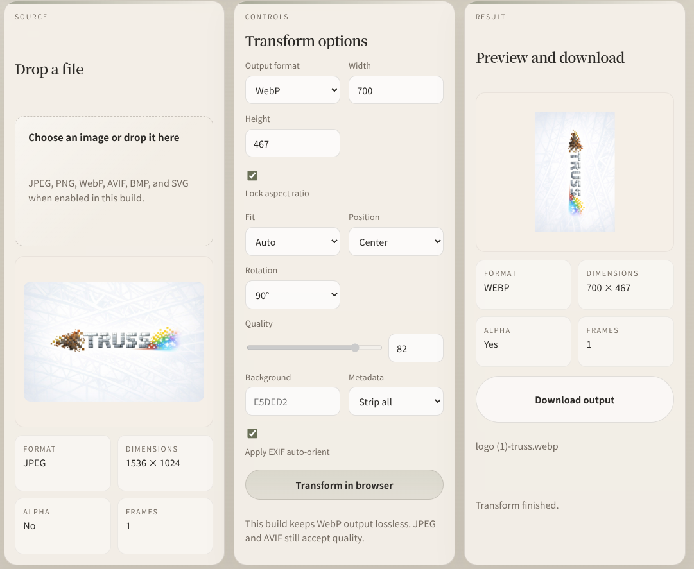
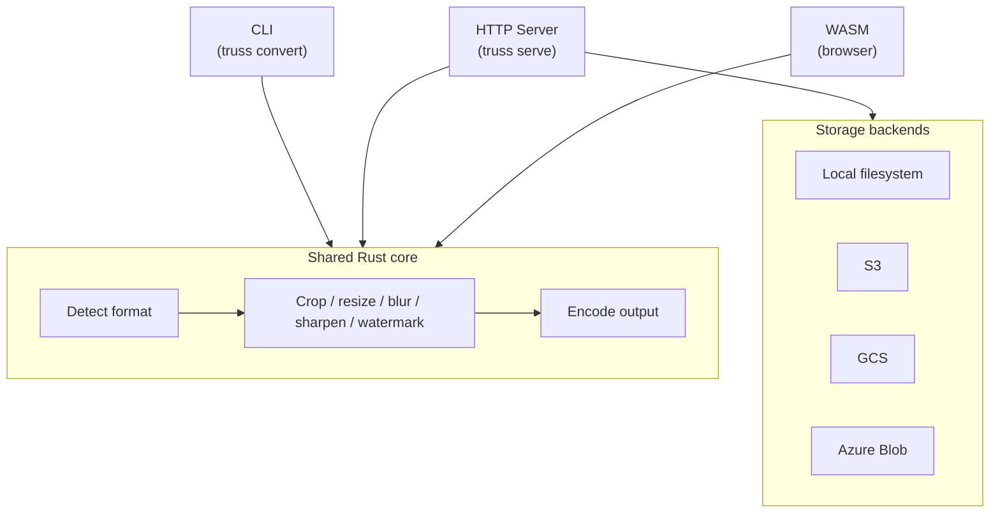
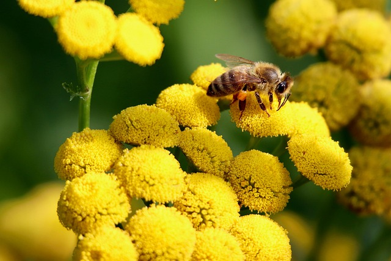
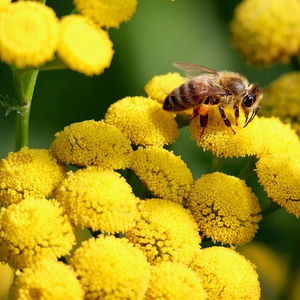
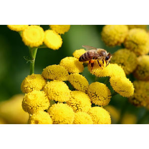
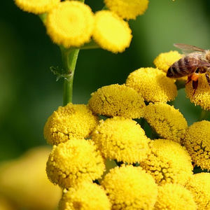
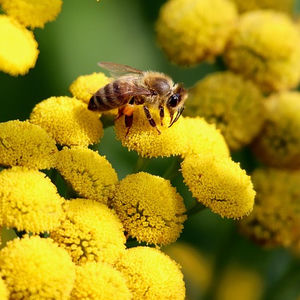
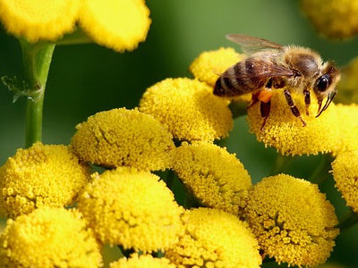
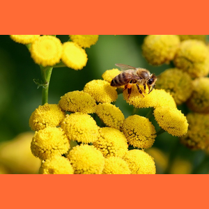

# truss

[](https://github.com/nao1215/truss/actions/workflows/rust.yml)
[](https://github.com/nao1215/truss/actions/workflows/integration-cli.yml)
[](https://github.com/nao1215/truss/actions/workflows/integration.yml)
[](https://crates.io/crates/truss-image)
[](https://crates.io/crates/truss-image)
[](LICENSE)
[](https://www.rust-lang.org/)


Resize, crop, convert, optimize, blur, sharpen, and watermark images from the CLI, an HTTP server, or the browser -- written in Rust with signed-URL authentication and SSRF protection built in.

[Try the WASM demo in your browser](https://nao1215.github.io/truss/) -- no install, no upload, runs 100 % client-side.



## Why truss?

- One binary, three interfaces -- the same Rust core powers the CLI, an HTTP image-transform server, and a WASM browser demo.
- Security by default -- signed URLs, SSRF protections, and SVG sanitization are built in.
- Broad format support -- JPEG, PNG, WebP, AVIF, BMP, and SVG; retains EXIF, ICC, and XMP metadata where possible.
- Cross-platform -- Linux, macOS, Windows.
- Tested contracts -- CLI behavior is locked by [ShellSpec](https://github.com/shellspec/shellspec), HTTP API by [runn](https://github.com/k1LoW/runn).

## Comparison

Feature comparison with [imgproxy](https://github.com/imgproxy/imgproxy) and [imagor](https://github.com/cshum/imagor) as of March 2026.

| Feature | truss | imgproxy | imagor |
|---------|:-----:|:--------:|:------:|
| Language | Rust | Go | Go |
| Runtime dependencies | None | libvips (C) | libvips (C) |
| CLI | Yes | No | No |
| WASM browser demo | Yes | No | No |
| Signed URLs | Yes | Yes | Yes |
| JPEG / PNG / WebP / AVIF | Yes | Yes | Yes |
| JPEG XL (JXL) | No | Input only | Yes |
| TIFF | Yes | Yes | Yes |
| GIF animation processing | No (out of scope) | Yes | Yes |
| SVG sanitization | Yes | Yes | No |
| Smart crop | No | Yes | Yes |
| Sharpen filter | Yes | Yes | Yes |
| Crop / Trim / Padding | Yes | Yes | Yes |
| S3  | Yes | Yes | Yes |
| GCS | Yes | Yes | Yes |
| Azure Blob Storage | Yes | Yes | No |
| Watermark | Yes | Yes | Yes |
| Prometheus metrics | Yes | Yes | Yes |
| License | MIT | Apache 2.0 | Apache 2.0 |

## Architecture



CLI reads local files or fetches remote URLs directly. The HTTP server resolves images from storage backends or client uploads. The WASM build processes files selected in the browser.

## Installation

```sh
cargo install truss-image
```

Prebuilt binaries are available on the [GitHub Releases](https://github.com/nao1215/truss/releases) page. See [Deployment Guide](docs/deployment.md) for details on all targets and Docker images.

## Quick Start

### CLI

The `convert` subcommand can be omitted: `truss photo.png -o photo.jpg` is equivalent to `truss convert photo.png -o photo.jpg`. Run `truss convert --help` to see the full set of options.

```sh
# Convert format
truss photo.png -o photo.jpg

# Resize + convert
truss photo.png -o thumb.webp --width 800 --format webp --quality 75

# Optimize in place with the shared pipeline
truss optimize photo.jpg -o photo-optimized.jpg --mode auto

# Convert from a remote URL
truss --url https://example.com/img.png -o out.avif --format avif

# Sanitize SVG (remove scripts and external references)
truss diagram.svg -o safe.svg

# Inspect metadata
truss inspect photo.jpg
```

#### Format conversion & quality

truss supports **JPEG, PNG, WebP, AVIF, BMP, TIFF, and SVG**. The output format is inferred from the file extension, or you can specify it explicitly with `--format`.

| Format | File size (640 × 427) | Notes |
|--------|----------------------:|-------|
| JPEG (original) | 80 KB | Lossy, widely supported |
| WebP (`--quality 80`) | 38 KB | ~52 % smaller than JPEG |
| AVIF (`--quality 50`) | 17 KB | ~79 % smaller than JPEG |
| PNG | 480 KB | Lossless |

```sh
# JPEG → WebP (smaller file, same visual quality)
truss photo.jpg -o photo.webp --quality 80

# JPEG → AVIF (best compression)
truss photo.jpg -o photo.avif --quality 50

# Explicit format override (ignore extension)
truss photo.jpg -o output.bin --format png
```

Use `--quality <1-100>` to control lossy encoding. Lower values produce smaller files at the cost of visual quality.

Use `--optimize auto|lossless|lossy` on `truss convert`, or the dedicated `truss optimize` subcommand, to reduce output size with format-aware encoding choices. Add `--target-quality ssim:0.98` or `--target-quality psnr:42` when you want lossy optimization to aim for a specific perceptual threshold.

| Quality 90 (95 KB) | Original (80 KB) | Quality 30 (27 KB) |
|---|---|---|
|  |  |  |

#### Resize & fit modes

Specify `--width` and/or `--height` to resize. When both are given, `--fit` controls how the image fits the target box:

| Mode | Behavior |
|------|----------|
| `contain` (default) | Scale down to fit entirely inside the box, preserving aspect ratio. Padding is filled with `--background`. |
| `cover` | Scale to fill the box completely, cropping excess. Use `--position` to choose the crop anchor. |
| `fill` | Stretch to exact dimensions (ignores aspect ratio). |
| `inside` | Like `contain`, but never upscales a smaller image. |

| Original (640 × 427) | contain 300 × 300 | cover 300 × 300 | fill 300 × 300 | inside 300 × 300 |
|---|---|---|---|---|
|  |  |  |  |  |

```sh
# contain -- fit inside the box, pad with gray background
truss photo.jpg -o out.jpg --width 300 --height 300 --fit contain --background CCCCCC

# cover -- fill the box, crop the excess
truss photo.jpg -o out.jpg --width 300 --height 300 --fit cover

# fill -- stretch to exact dimensions
truss photo.jpg -o out.jpg --width 300 --height 300 --fit fill

# inside -- like contain, but never upscale
truss photo.jpg -o out.jpg --width 300 --height 300 --fit inside

# Width only -- height is calculated to preserve aspect ratio
truss photo.jpg -o out.jpg --width 800
```

#### Cover position

When using `--fit cover`, `--position` controls which part of the image is kept:

| `--position top-left` | `--position center` (default) | `--position bottom-right` |
|---|---|---|
|  |  |  |

Available positions: `center`, `top`, `right`, `bottom`, `left`, `top-left`, `top-right`, `bottom-left`, `bottom-right`.

```sh
truss photo.jpg -o thumb.jpg --width 300 --height 300 --fit cover --position top-left
```

#### Crop, rotate & background

```sh
# Crop a region (x, y, width, height) -- applied before resize
truss photo.jpg -o cropped.jpg --crop 100,50,400,300

# Rotate 270 degrees clockwise (accepts 0, 90, 180, 270)
truss photo.jpg -o rotated.jpg --rotate 270

# Background color as RRGGBB or RRGGBBAA hex (useful with contain or PNG alpha)
truss photo.jpg -o out.png --width 300 --height 300 --fit contain --background FF6B35FF
```

| Original | Crop (`--crop 100,50,400,300`) | Rotate (`--rotate 270`) | Background (`--background FF6B35FF`) |
|---|---|---|---|
|  |  |  |  |

#### Blur, sharpen & watermark

| Original | Gaussian Blur (`--blur 5.0`) | Sharpen (`--sharpen 3.0`) | Watermark |
|---|---|---|---|
|  |  |  |  |

```sh
# Gaussian blur (sigma 0.1 - 100.0)
truss photo.jpg -o blurred.jpg --blur 5.0

# Sharpen (sigma 0.1 - 100.0)
truss photo.jpg -o sharpened.jpg --sharpen 3.0

# Watermark with full control
truss photo.jpg -o watermarked.jpg \
  --watermark logo.png \
  --watermark-position bottom-right \
  --watermark-opacity 50 \
  --watermark-margin 10
```

Watermark positions are the same as cover positions: `center`, `top`, `right`, `bottom`, `left`, `top-left`, `top-right`, `bottom-left`, `bottom-right`.

> **Note:** `--blur`, `--sharpen`, and `--watermark` are raster-only and not supported for SVG inputs.

#### Metadata control

By default, truss strips all metadata for smaller and safer output.

| Flag | Behavior |
|------|----------|
| `--strip-metadata` (default) | Remove all EXIF, ICC, and other metadata |
| `--keep-metadata` | Preserve EXIF, ICC, and all other supported metadata |
| `--preserve-exif` | Keep EXIF only, strip ICC and others |
| `--auto-orient` (default) | Apply EXIF orientation tag and reset it |
| `--no-auto-orient` | Skip EXIF orientation correction |

```sh
# Keep all metadata (useful for archival)
truss photo.jpg -o out.jpg --keep-metadata

# Keep EXIF only (strip ICC profiles)
truss photo.jpg -o out.jpg --preserve-exif

# Disable auto-orientation
truss photo.jpg -o out.jpg --no-auto-orient
```

#### Stdin / stdout piping

Use `-` for input and/or output to integrate truss into shell pipelines. When reading from stdin, `--format` is required for output.

```sh
# Pipe from stdin to stdout
cat photo.png | truss - -o - --format jpeg > photo.jpg

# Download, convert, and upload in one pipeline
curl -s https://example.com/img.png | truss - -o - --format webp --width 800 | \
  aws s3 cp - s3://bucket/thumb.webp

# Optimize after converting
truss photo.jpg -o - --format webp --optimize auto | cat > optimized.webp
```

#### SVG handling

truss sanitizes SVG files by removing scripts and external references, making them safe for user-generated content.

```sh
# Sanitize SVG (remove scripts, external refs)
truss diagram.svg -o safe.svg

# Rasterize SVG to PNG at a specific width
truss diagram.svg -o diagram.png --width 1024
```

#### Filenames starting with `-`

Use `--output=` (or `--output`) to avoid ambiguity with filenames that start with a dash:

```sh
# Dash-prefixed output: use --output= to assign the value unambiguously
truss convert input.png --output=-output.jpg

# Dash-prefixed input: use a path prefix
truss convert ./-input.png -o out.jpg
```

### WASM

truss also ships a browser-oriented WASM adapter for local, client-side image processing. The generated package exposes a small JS-facing API over the same Rust core used by the CLI and HTTP server.

For bundler-based browser apps, the repository includes the source for the official npm package in [`packages/truss-wasm`](./packages/truss-wasm). It uses the fixed feature set `wasm,svg,avif`, so AVIF is available and WebP stays lossless in the package build.

```js
import {
  getCapabilitiesJson,
  inspectImageJson,
  transformImage,
} from "@nao1215/truss-wasm";

const inputBytes = new Uint8Array(await file.arrayBuffer());
const capabilities = JSON.parse(getCapabilitiesJson());
const inspected = JSON.parse(inspectImageJson(inputBytes, undefined));

const result = transformImage(
  inputBytes,
  undefined,
  JSON.stringify({
    format: "jpeg",
    width: 1200,
    quality: 80,
  }),
);
```

The official npm package is generated with `wasm-bindgen --target bundler`, so it does not require an explicit `init()` step.

The example below assumes your page is served from a directory that also contains `pkg/truss.js`. When using `./scripts/build-wasm-demo.sh`, that means `web/dist/index.html` importing `./pkg/truss.js`.

```js
import init, {
  getCapabilitiesJson,
  inspectImageJson,
  transformImage,
} from "./pkg/truss.js";

await init();

const inputBytes = new Uint8Array(await file.arrayBuffer());
const capabilities = JSON.parse(getCapabilitiesJson());
const inspected = JSON.parse(inspectImageJson(inputBytes, undefined));

const result = transformImage(
  inputBytes,
  undefined,
  JSON.stringify({
    format: "jpeg",
    width: 1200,
    quality: 80,
  }),
);

const response = JSON.parse(result.responseJson);
const outputBlob = new Blob([result.bytes], {
  type: response.artifact.mimeType,
});
```

The GitHub Pages demo is intentionally built with `wasm,svg`. The official npm package uses `wasm,svg,avif`. Check capabilities at runtime and see [WASM Integration](docs/wasm.md) for package and raw-build usage, feature differences, import-path assumptions, API shapes, constraints, limits, and error handling.

### HTTP Server -- one curl to transform

```sh
# Start the server
TRUSS_BEARER_TOKEN=changeme truss serve --bind 0.0.0.0:8080 --storage-root ./images

# Resize a local image to 400 px wide WebP in one request
curl -X POST http://localhost:8080/images \
  -H "Authorization: Bearer changeme" \
  -F "file=@photo.jpg" \
  -F 'options={"format":"webp","width":400}' \
  -o thumb.webp
```

See the [API Reference](docs/api-reference.md) for the full endpoint list and CDN integration guide.

## Commands

| Command | Description |
|---------|-------------|
| `convert` | Convert and transform an image file (can be omitted; see above) |
| `optimize` | Optimize an image with format-aware auto/lossless/lossy modes (`truss optimize photo.jpg -o photo-optimized.jpg --mode auto`) |
| `inspect` | Show metadata (format, dimensions, alpha) of an image |
| `serve` | Start the HTTP image-transform server (implied when server flags are used at the top level) |
| `validate` | Validate server configuration without starting the server (useful in CI/CD) |
| `sign` | Generate a signed public URL for the server |
| `completions` | Generate shell completion scripts |
| `version` | Print version information |
| `help` | Show help for a command (e.g. `truss help convert`) |

## Documentation

| Page | Description |
|------|-------------|
| [Configuration Reference](docs/configuration.md) | Environment variables, storage backends, logging, and all server settings |
| [API Reference](docs/api-reference.md) | HTTP endpoints, request/response formats, CDN integration |
| [Signed URL Specification](docs/signed-url-spec.md) | Canonicalization rules, compatibility policy, and SDK guidance for public signed URLs |
| [Deployment Guide](docs/deployment.md) | Docker, prebuilt binaries, cloud storage (S3/GCS/Azure), production setup |
| [Development Guide](docs/development.md) | Building from source, testing, benchmarks, WASM demo, contributing |
| [WASM Integration](docs/wasm.md) | Browser build flags, JS API contract, runtime capabilities, limits, and caveats |
| [Prometheus Metrics](docs/prometheus.md) | Metrics reference, bucket boundaries, example PromQL queries |
| [OpenAPI Spec](docs/openapi.yaml) | Machine-readable API specification |

## Roadmap

See the [public roadmap](https://github.com/nao1215/truss/issues?q=is%3Aissue+label%3Aroadmap) for planned features and milestones.

## Contributing

Contributions are welcome. See [CONTRIBUTING.md](CONTRIBUTING.md) for details.

- Look for [`good first issue`](https://github.com/nao1215/truss/issues?q=is%3Aissue+is%3Aopen+label%3A%22good+first+issue%22) to get started.
- Report bugs and request features via [Issues](https://github.com/nao1215/truss/issues).
- If the project is useful, starring the repository helps.
- Support via [GitHub Sponsors](https://github.com/sponsors/nao1215) is also welcome.
- Sharing the project on social media or in blog posts is appreciated.

## License

Released under the [MIT License](LICENSE).
