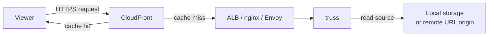

# API Reference

This page documents the HTTP API endpoints, request/response formats, and related features of the truss image-transform server.

## OpenAPI Specification

- OpenAPI YAML: [openapi.yaml](openapi.yaml)
- Swagger UI on GitHub Pages: https://nao1215.github.io/truss/swagger/

## Starting the Server

By default, the server listens on `127.0.0.1:8080`. Configuration can be supplied through environment variables or CLI flags. See the [Configuration Reference](configuration.md) for all available settings.

```sh
truss serve --bind 0.0.0.0:8080 --storage-root /var/images
```

To validate the server configuration without starting the server (useful in CI/CD pipelines):

```sh
truss validate
```

## Quick Example

```sh
# Start the server
TRUSS_BEARER_TOKEN=changeme truss serve --bind 0.0.0.0:8080 --storage-root ./images

# Resize a local image to 400 px wide WebP in one request
curl -X POST http://localhost:8080/images \
  -H "Authorization: Bearer changeme" \
  -F "file=@photo.jpg" \
  -F 'options={"format":"webp","width":400}' \
  -o thumb.webp

# Signed public URL (no Bearer token needed)
truss sign --base-url http://localhost:8080 \
  --path photos/hero.jpg --key-id mykey --secret s3cret \
  --expires 1900000000 --width 800 --format webp  # Unix timestamp (2030-03-17)
# => http://localhost:8080/images/by-path?path=photos/hero.jpg&width=800&format=webp&keyId=mykey&expires=1900000000&signature=...
```

## Endpoints

### Public Endpoints (Signed URL)

| Endpoint | Description |
|----------|-------------|
| `GET /images/by-path` | Fetch and transform an image from storage by path, authenticated via signed URL |
| `GET /images/by-url` | Fetch and transform an image from a remote URL, authenticated via signed URL |

### Private Endpoints (Bearer Token)

| Endpoint | Description |
|----------|-------------|
| `POST /images:transform` | Transform an image from storage or remote URL |
| `POST /images` | Upload and transform an image via multipart form |

### Infrastructure Endpoints

| Endpoint | Description |
|----------|-------------|
| `GET /health/live` | Liveness probe (always returns 200) |
| `GET /health/ready` | Readiness probe (returns 503 when draining, disk full, or memory limit exceeded) |
| `GET /metrics` | Prometheus metrics in text exposition format |

## Supported Formats

| Input \ Output | JPEG | PNG | WebP | AVIF | BMP | TIFF | SVG |
|-------------|:----:|:---:|:----:|:----:|:---:|:----:|:---:|
| JPEG        | Yes  | Yes | Yes  | Yes  | Yes | Yes  | -   |
| PNG         | Yes  | Yes | Yes  | Yes  | Yes | Yes  | -   |
| WebP        | Yes  | Yes | Yes  | Yes  | Yes | Yes  | -   |
| AVIF        | Yes  | Yes | Yes  | Yes  | Yes | Yes  | -   |
| BMP         | Yes  | Yes | Yes  | Yes  | Yes | Yes  | -   |
| TIFF        | Yes  | Yes | Yes  | Yes  | Yes | Yes  | -   |
| SVG         | Yes  | Yes | Yes  | Yes  | Yes | Yes  | Yes |

SVG to SVG performs sanitization only, removing scripts and external references.

## CDN / Reverse-Proxy Integration

truss is an image transformation origin, not a CDN itself. In production, place a CDN such as CloudFront (or a reverse proxy like nginx / Envoy) in front of truss so that transformed images are cached at the edge.



- CloudFront is the cache layer. It serves cached responses directly on cache hits.
- truss is the origin API. Image transformation runs on truss, not on CloudFront.
- An ALB or reverse proxy is recommended between CloudFront and truss because truss does not handle TLS termination or large-scale traffic on its own.
- The truss on-disk cache (`TRUSS_CACHE_ROOT`) is a single-node auxiliary cache that reduces redundant transforms on the origin; it is not a replacement for the CDN cache.

### Public vs. Private Endpoints

Only the public GET endpoints should be exposed through CloudFront:

| Endpoint | Visibility | CloudFront |
|----------|-----------|------------|
| `GET /images/by-path` | Public (signed URL) | Origin for CDN |
| `GET /images/by-url` | Public (signed URL) | Origin for CDN |
| `POST /images:transform` | Private (Bearer token) | Do not expose |
| `POST /images` | Private (Bearer token) | Do not expose |

### CDN Cache Key Configuration

CDN cache keys must vary by the signed-URL authentication inputs and any transform query parameters used by the public GET endpoints (`GET /images/by-path`, `GET /images/by-url`). Configure your CDN / CloudFront Cache Policy to include the following query string parameters in the cache key (or use a policy that forwards all query strings):

- Authentication: `keyId`, `expires`, `signature`
- Source: `path` or `url`, `version`
- Transform: `width`, `height`, `fit`, `position`, `format`, `quality`, `background`, `rotate`, `autoOrient`, `stripMetadata`, `preserveExif`, `crop`, `blur`, `sharpen`, `preset`

This ensures that a cached response for one signed URL is not served to requests with different or expired signatures, and different transform options produce separate cache entries.

### `TRUSS_PUBLIC_BASE_URL`

When truss runs behind CloudFront, set `TRUSS_PUBLIC_BASE_URL` to the public CloudFront domain (e.g. `https://images.example.com`). Signed-URL verification compares the request authority against this value; a mismatch will cause signature validation to fail.

```sh
TRUSS_PUBLIC_BASE_URL=https://images.example.com truss serve
```
